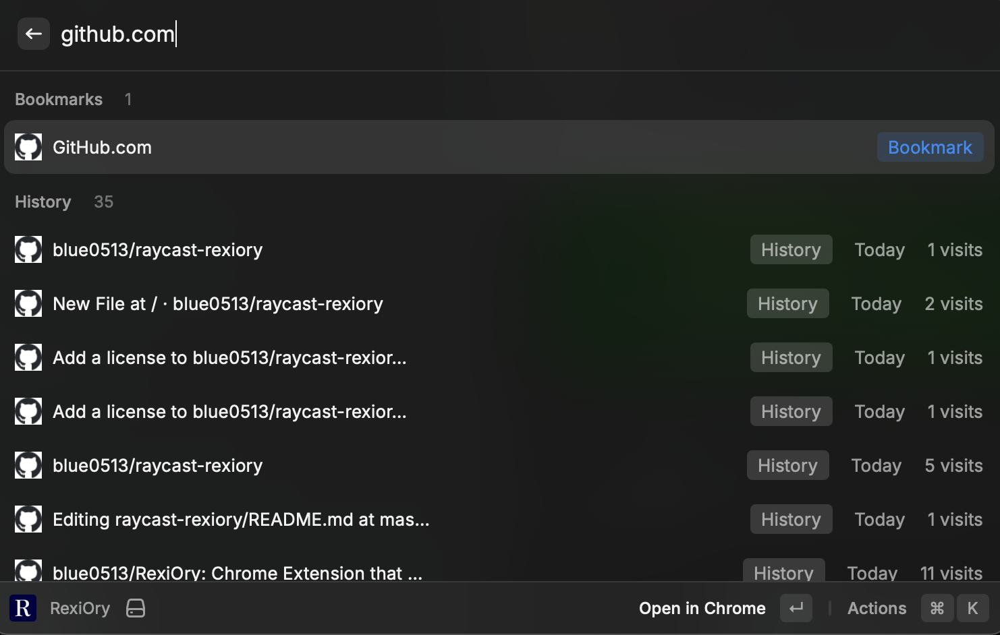

# raycast-rexiory

A [Raycast](https://raycast.com) extension that brings [RexiOry](https://github.com/blue0513/RexiOry) to your desktop — search Google Chrome history and bookmarks instantly with fuzzy matching.



## Features

- **Cross-search** — history and bookmarks in a single unified list
- **Fuzzy search** — tolerant of typos and partial matches, powered by Fuse.js
- **Multi-word AND search** — `claude skill` finds pages containing both words
- **Favicon display** — visually identify sites at a glance
- **Visit metadata** — last visit date and visit count for history entries
- **Fallback search** — when no results match, search the web in Chrome without leaving Raycast
- **Opens in Chrome** — results open in your existing Chrome window as a new tab

## Installation

1. Clone this repository:
```bash
git clone https://github.com/blue0513/raycast-rexiory.git
cd raycast-rexiory
```
2. Install dependencies:
```bash
npm install
```
3. Build the extension:
```bash
npm run build
```
4. Open Raycast, search for **"Import Extension"**, and select the cloned directory

> This manual step is required only once. Raycast will remember the extension across restarts.

The extension is now available in Raycast as **RexiOry**.

## Requirements

- macOS
- Google Chrome (Default profile)

## Usage

Invoke **RexiOry** from Raycast and start typing.

| Section | Content |
|---|---|
| **Bookmarks** | All bookmarks from Chrome's Default profile |
| **History** | Recently visited pages with visit date and visit count |

When there are no results, a fallback action opens your configured search engine in Chrome.

### Keyboard Shortcuts

| Shortcut | Action |
|---|---|
| `↵` | Open in Chrome |
| `⌘ C` | Copy URL |
| `⌘ ⇧ C` | Copy title |
| `⌥ ↵` | Fallback web search |

## Preferences

| Preference | Description | Default |
|---|---|---|
| Fallback Search Engine | Search engine for fallback web search | Google |
| Max History Results | Number of history entries to load | 10000 |

## Notes

- Chrome's History file is a locked SQLite database. This extension copies it to a temporary location at query time — no data is modified.
- Bookmarks are read from Chrome's JSON file and deduplicated by URL.
- For the freshest history, Chrome should be running (recent visits are flushed to disk periodically).
- Only Chrome's `Default` profile is supported.
